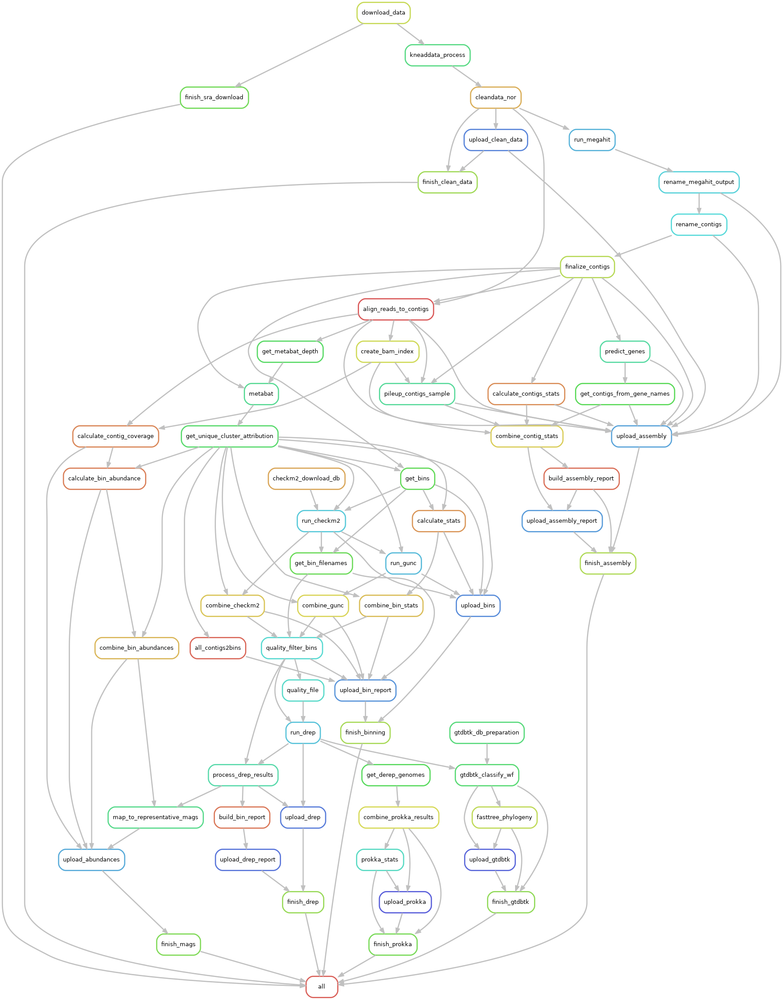

# Metagenomics Data Processing Workflow

This Snakemake workflow is designed for processing metagenomic sequencing data, handling everything from data download to cleaning and analysis.

## Workflow Structure



## Workflow usage

1. modify config.yaml
	-	path.user_root
	-	path.meta_path
	-	samples
	-	dbs.human
	-	database_dir
	-	host
	-	upload
	-	upload_tag
	-	kneaddata_opt.trimmomatic
	-	megahit_set
	-	genome_filter_criteria
	-	filter_chimieric_bins
2. modify Snakefile to chose some rules
3. confirm some remove rules

RUN：

```bash
snakemake --executor slurm --use-conda --default-resources slurm_account=<SLURM ACCOUNT> slurm_partition=<SLURM PARTITION> -j <TASK COUNT> --resources download_slots=<NUM> upload_slots=<NUM>
```

